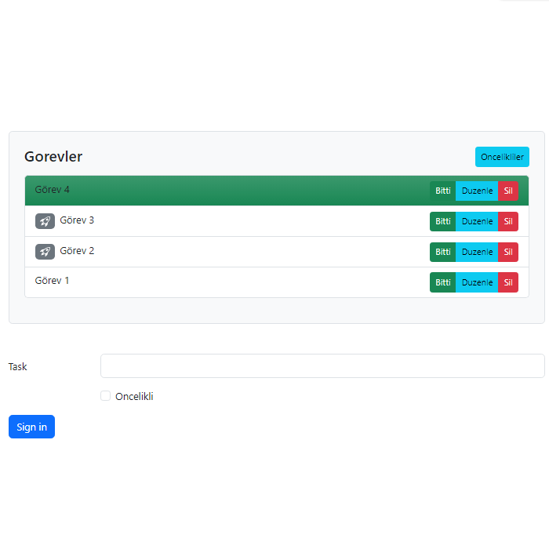

# React To Do List

Bu proje, yapılacaklar listesi uygulamasıdır. React kullanılarak yapılmıştır
## Neler Yapılabilir

- Yapacağınız görevleri yazılabilir

- Düzenlenebilir

- Öncelikli olarak işaretlenebilir

- Öncelikli olarak işaretlenenler filtrelenilebilir

- Bitti diye işaretlenebilir

- Silebilirsiniz


  
## Bilgisayarınızda Çalıştırın

Projeyi klonlayın

```bash
  git clone https://github.com/remolg/Todolist.git
```

Proje dizinine gidin ve çalıştırın

```bash
  cd "Todolist-main"
```

```bash
  npm install
```

```bash
  npm run dev
``````

Uygulama, http://localhost:3000 adresinde çalışacaktır.
## Ekran Görüntüleri


